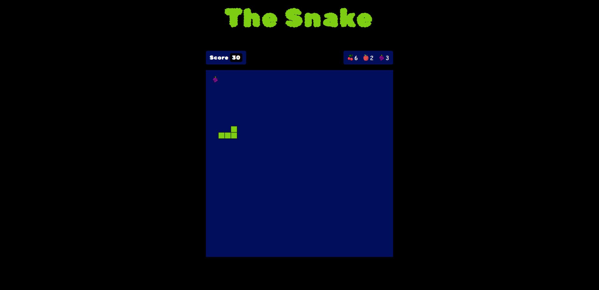
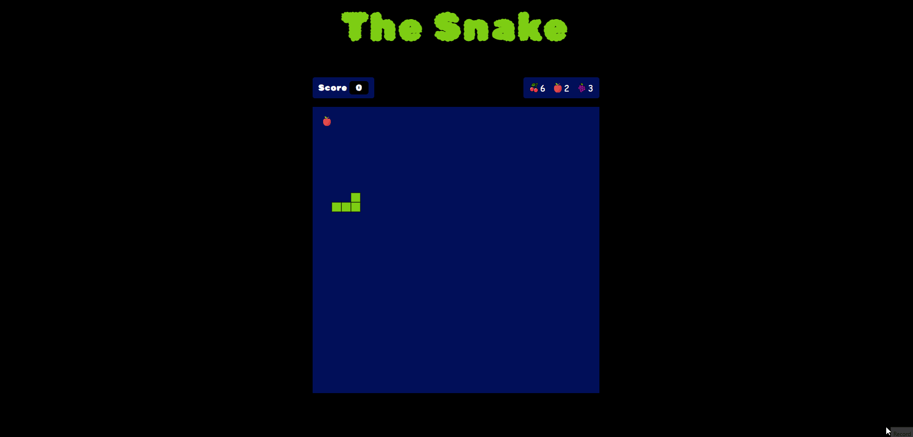

# The Snake Game
This is a JavaScript implementation of the classic Snake game with added features 
such as different types of food for the snake and varying molt rates for each fruit.

## Acknowledgements
This project owes its inspiration and knowledge to countless online tutorials and resources.

## Gameplay
Use arrow keys to move the snake continuously in one direction. 
Eat randomly appearing fruits to grow the snake's length based on the fruit's molt rate. 
Win by reaching a molt limit of 450 or lose by colliding.
### Fruit Types
  - Apples increase molt rate by 2
  - Cherries increase molt rate by 6
  - Grapes increase molt rate by 3

## Overview

## Demo
> This gif shows a brief overview of the project, and it may take a while to load!

## Getting Started
To run this project locally using the Live Server extension in VS Code:
- Clone or download this repository
- Open the folder containing the project files in VS Code
- Install the Live Server extension
- Right click the index.html file and select "Open with Live Server"
  This will launch a development local server with hot reloading
- Select a quiz category and start answering questions!

